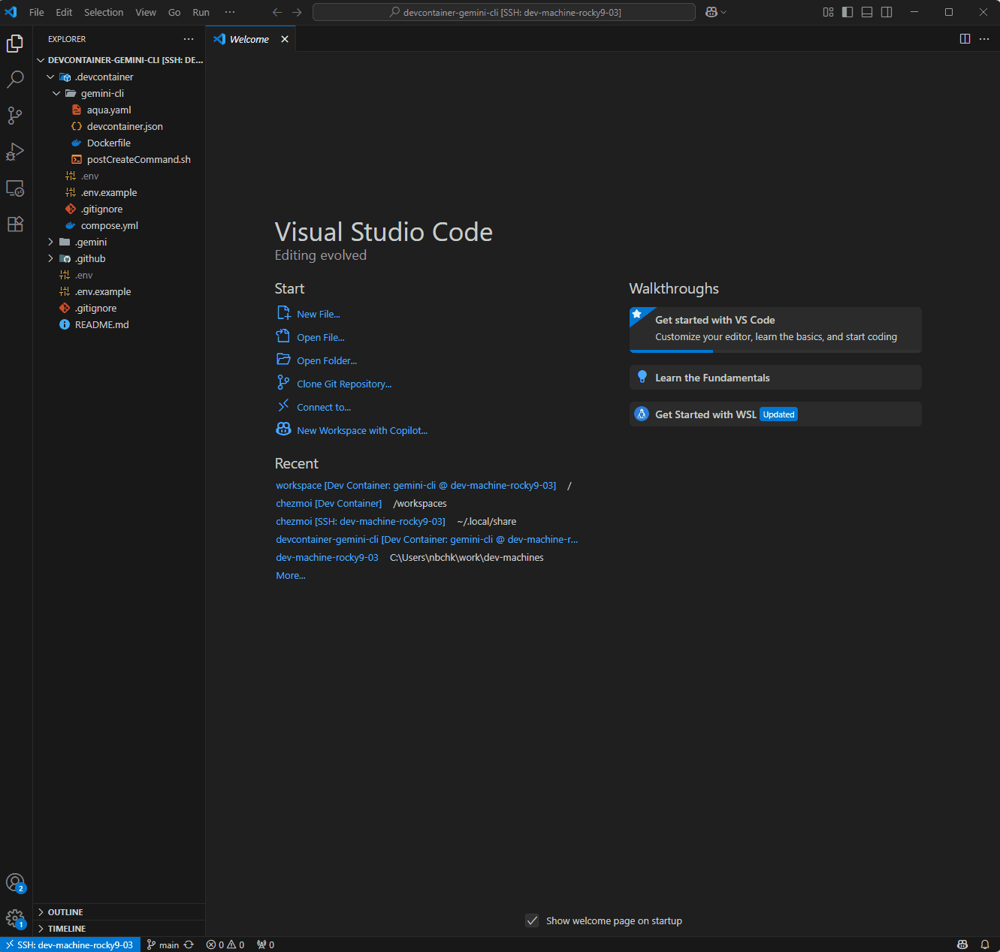

# Gemini CLI Dev Container

[](https://github.com/codequokka/devcontainer-gemini-cli/actions/workflows/run_devcontainer_ci.yaml)
[](https://github.com/codequokka/devcontainer-gemini-cli/actions/workflows/run_github_actions_workflow_ci.yml)

This repository provides a pre-configured development environment using [VS Code Dev Containers](https://code.visualstudio.com/docs/devcontainers/containers) to easily get started with the [Google Gemini CLI](https://github.com/google-gemini/gemini-cli). It allows you to use the Gemini CLI in a sandboxed, consistent, and reproducible environment without needing to install `npm` or other dependencies directly on your host machine.



## ✨ Features

- **Zero Configuration**: Just open this repository in a Dev Container and you're ready to go.
- **Isolated Environment**: The Gemini CLI and its dependencies are installed inside a Docker container, keeping your local system clean.
- **Reproducible**: Ensures everyone on a team has the exact same development environment.
- **Pre-installed Tools**: Comes with `@google/gemini-cli` ready to use.

## 🚀 Getting Started

### Prerequisites

- [Docker](https://www.docker.com/products/docker-desktop/)
- [Visual Studio Code](https://code.visualstudio.com/)
- [VS Code Dev Containers extension](https://marketplace.visualstudio.com/items?itemName=ms-vscode-remote.remote-containers)
- [VS Code Remote - SSH extension](https://marketplace.visualstudio.com/items?itemName=ms-vscode-remote.remote-ssh)

### Quick Start

1.  **Clone the Repository**
    Clone this repository to your local or remote machine.

    ```bash
    git clone https://github.com/codequokka/devcontainer-gemini-cli.git
    cd devcontainer-gemini-cli
    ```

2.  **Create Environment File**
    Create a `.env` file for the devcontainer. This step ensures that files created in the container have the correct ownership on your host machine.

    ```bash
    cat <<EOF > .devcontainer/.env
    UID=$(id -u)
    GID=$(id -g)
    EOF
    ```

3.  **Open in Dev Container**
    Open the repository folder in Visual Studio Code. When prompted, click on **"Reopen in Container"**. This will build the Docker container and set up the environment for the first time.

    > **Note**
    > If you don't see the prompt, press `F1` and type `Dev Containers: Reopen in Container`.

Once the Dev Container is running, you can start using the Gemini CLI in the VS Code terminal.

## 🔑 Authentication

To use the Gemini CLI, you need to authenticate with your Google account. The following commands should be run in the VS Code terminal.

### Option 1: Login with Google (Recommended)

1.  Execute the `gemini` command to start the authentication process:
    ```bash
    gemini
    ```
2.  Select `1. Login with Google` from the menu.
3.  Follow the URL in the terminal and enter the verification code to complete the login.

### Option 2: Use a Gemini API Key

If you prefer to use an API key:

1.  [Get your Gemini API Key](https://aistudio.google.com/apikey) from Google AI Studio.
2.  Add your Gemini API key to a `.env` file in the root of the repository:
    ```bash
    echo "GEMINI_API_KEY=your-gemini-api-key" > .env
    ```
    > **Security Note**: Be careful not to commit the `.env` file to your repository. It is already listed in `.gitignore`.
3.  The Gemini CLI will automatically use the API key from the `.env` file.
